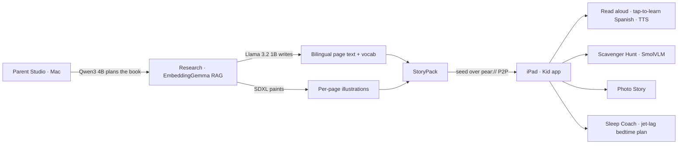

<div align="center">
  

  # TaleTrip

  **Turn a family trip into a personalized, bilingual AI picture book — created &amp; read 100% on-device.**

  A parent's **Mac** writes &amp; illustrates the book → sent to the kid's **iPad** over **P2P** → the kid reads it aloud, learns Spanish, and plays camera games.

  _No cloud. No accounts. No data ever leaves the device._

  
  
  
  
  
  
</div>

---

## Table of Contents

- [Project Overview](#project-overview)
- [Getting Started](#getting-started)
- [Problem](#problem)
- [Why AI](#why-ai)
- [Why Offline & On-Device](#why-offline--on-device)
- [How It Works](#how-it-works)
- [Demo](#demo)
- [Roadmap](#roadmap)
- [Validation](#validation)
- [Evidence & Artifacts](#evidence--artifacts)
- [Risks](#risks)
- [Team](#team)
- [License](#license)

---

## Project Overview

TaleTrip is a fully offline, on-device AI picture-book app for traveling families. A parent describes the trip and the child; on a Mac, an **agentic pipeline plans, researches, writes, and illustrates** a bilingual storybook starring that child in that destination. The book is delivered **peer-to-peer** to the kid's iPad, where it is read aloud, teaches Spanish vocabulary, and turns into camera games — all without a network.

```
Parent (Mac · Parent Studio)              Kid (iPad · offline)
  trip + child profile           →          receive over P2P (pear://)
  plan → research → write → paint  →         read · learn words · play
  on-device LLM/SDXL/RAG          →          no cloud · no accounts · private
```

Built for the **QVAC Hackathon (Mobile track)** on Expo SDK 56 + React Native 0.85, using the QVAC SDK to run every model — language, diffusion, vision, speech, and embeddings — locally.

## Getting Started

```bash
# 1. install dependencies
npm install

# 2. Kid app (iPad) — build & run the native app, then Metro serves the JS
npm run ios            # or: npm start  (Metro only)

# 3. Parent Studio (Mac) — on-device generation server on http://localhost:3000
node node_modules/.bin/bare studio/server.mjs

# type-check (strict)
npx tsc --noEmit
```

> The Studio server warms up the local models on launch (LLM, SDXL, VLM, TTS, embeddings) and seeds the bundled demo book over P2P. Generation needs an Apple Silicon Mac; the iPad runs the reader and games.

## Problem

- Kids' digital content is generic, cloud-bound, and rarely bilingual or about the child's own life.
- Family travel brings jet lag and unfamiliar places, but nothing turns a real trip into a gentle, personalized bedtime story.
- Parents worry about privacy: today's "AI for kids" ships children's photos, voices, and prompts to someone else's servers.

## Why AI

- Generates a one-of-a-kind story that **stars the child** and is set in their **real destination**.
- On-device models do everything: an LLM writes the prose, **SDXL** paints each page, a **VLM** powers camera games, and **TTS** reads it aloud.
- **RAG** grounds the story in real destination facts and steers it toward the family's favorite picture-book style.
- Small models are wrapped in deterministic guardrails so output stays safe, on-topic, and age-appropriate.

## Why Offline & On-Device

- **Privacy by design** — photos, prompts, and audio never leave the device.
- **Works with zero connectivity** — on a plane, a train, or abroad with no SIM.
- **No accounts, no servers, no per-token cloud cost.**
- **Sharing is peer-to-peer** — the parent's Mac seeds the book directly to the kid's iPad over `pear://`, device to device.

## How It Works



### MVP Scope Freeze

| Priority | Included |
| --- | --- |
| P0 | Offline bilingual reader: real illustrations, tap colored words → flashcard + pronunciation, on-device read-aloud |
| P0 | Parent Studio agentic generation (plan → research → write → paint) with picture-book style RAG |
| P1 | Camera games: Scavenger Hunt (on-device VLM) and Photo Story |
| P1 | Sleep Coach — bidirectional jet-lag bedtime plan with MedPsy guardrails |
| P2 | P2P "Get a book" delivery (a bundled demo book is the reliable fallback) |

## Demo

### Demo videos (per feature)

Each core feature, recorded running on real hardware:

| Feature | What runs on-device (QVAC SDK) | Watch |
| --- | --- | --- |
| **Parent Studio** — the Mac authoring app | Local model warm-up + picture-book **style RAG** (EmbeddingGemma) | ▶️ [youtu.be/HDn0kAgcNNY](https://youtu.be/HDn0kAgcNNY) |
| **Generate a story** — multi-agent pipeline | **Qwen3 4B** orchestrator + tool calls → **EmbeddingGemma** RAG → 4B writes the connected book → **SDXL** illustrates | ▶️ [youtu.be/9Uv2a9EIyG4](https://youtu.be/9Uv2a9EIyG4) |
| **Photo Story** (iPad) | **SmolVLM2 500M** captions each photo → **Llama 3.2 1B** writes the diary | ▶️ [youtu.be/aOYc-Tvb5Qw](https://youtu.be/aOYc-Tvb5Qw) |
| **Scavenger Hunt** (iPad) | **SmolVLM2 500M** recognizes real-world objects from the camera | ▶️ [youtu.be/BQbl9ClfkYA](https://youtu.be/BQbl9ClfkYA) |
| **Sleep Coach** (iPad) | Adaptive jet-lag bedtime plan authored by **MedPsy 1.7B** | ▶️ [youtu.be/rEMcw5sA89s](https://youtu.be/rEMcw5sA89s) |

### Main Flow

| Step | What Happens | Status |
| --- | --- | --- |
| 1 | Parent describes the trip + child in Parent Studio | ✅ |
| 2 | Agents plan, research, write, and paint the storybook | ✅ |
| 3 | Studio seeds the StoryPack over P2P (`pear://`) | ✅ |
| 4 | Kid taps "Get a book" on the iPad and receives it | ✅ |
| 5 | Kid reads bilingually, taps words, hears them read aloud | ✅ |
| 6 | Kid plays Scavenger Hunt & Photo Story; Sleep Coach guides bedtime | ✅ |

## Roadmap

| Stage | Direction |
| --- | --- |
| Now (MVP) | Bundled demo book, agentic generation, P2P delivery, offline reader + camera games |
| Next | More languages & voices, a richer picture-book style corpus, on-device generation on iPad |
| Later | Multi-child profiles, a parent dashboard, printable/exportable books |
| Vision | Every family trip becomes a personalized, private, fully offline storybook |

## Validation

| Evidence | Current Status | Notes |
| --- | --- | --- |
| On-device generation (MacBook, Apple Silicon) | ✅ Verified | Llama 3.2 1B ~1s/page, SDXL 512² ~28s, no OOM |
| P2P delivery Mac → iPad | ✅ Verified on device | `downloadAsset` + `pear://` Hyperdrive/Hyperswarm |
| On-device read-aloud (TTS) | ✅ Working | English narration + Spanish vocabulary |
| Scavenger Hunt VLM | ✅ Working | SmolVLM 500M, open-ended object naming |
| Sleep Coach jet-lag plan | ✅ Working | Bidirectional timezone + deterministic MedPsy guardrails |
| Picture-book style RAG | ✅ Working | EmbeddingGemma matches favorites → steers prose **and** illustration art |

## Evidence & Artifacts

Dual-side, on-device evidence is bundled in **[`taletrip-evidence.zip`](https://github.com/web3yaso/taletrip/releases/download/v0.1-demo/taletrip-evidence.zip)** (a [GitHub Release](https://github.com/web3yaso/taletrip/releases/tag/v0.1-demo) asset — raw logs are git-ignored). It contains:

- `mac-runs/` — per-run Studio traces (`events.jsonl` + `run.json`): every `loadModel` / `completion` / `diffusion` / `ragSearch` / `toolCall`, device-tagged `mac-studio`.
- `ipad-evidence/2026-06-16.jsonl` — every **on-device iPad** inference (TTS, SmolVLM, Llama 1B, P2P `downloadAsset`), device-tagged `iPad Pro (12.9-inch) (3rd generation)`.
- `book/` — a generated 5-page book (storypack + illustrations); `docs/` — How It Works, benchmarks, runbook, regression checklist, privacy experiment; `MANIFEST.md` maps each file to a judging criterion.

In this repo, the same docs live under [`docs/`](docs/) — see **[`docs/HOW_IT_WORKS.md`](docs/HOW_IT_WORKS.md)** for the full architecture and a captured-run evidence excerpt. (The demo video link goes in the Demo section above.)

### Remote APIs

**None.** All AI inference and RAG run on-device through the QVAC SDK — there are no cloud/LLM APIs. The only network use is **device-to-device P2P** (`pear://` Hyperdrive/Hyperswarm) to deliver a generated StoryPack from the parent's laptop to the kid's iPad; the iPad also works fully offline from the bundled book.

### Structured audit log

Every run writes a JSONL audit log (`artifacts/runs/<ts>/events.jsonl` on the Mac, `documents/evidence/<date>.jsonl` on the iPad). For a single demo run it captures **model loads/unloads** and **per-inference performance** — each `completion` records `promptTokens`, `generatedTokens`, `ttftMs` (time-to-first-token), `tokensPerSec`, and `backend` (cpu/gpu), alongside `loadModel` / `unloadModel`, `diffusion`, `ragSearch`, and `toolCall` events. Instrumentation lives at a single choke point (`src/models/qvac.ts`, `studio/evidence.mjs`).

## Risks

- **On-device compute:** heavy generation needs a capable Apple Silicon Mac; older iPads run the reader and games, not generation.
- **Tiny-model drift:** prose and advice pass through deterministic sanitizers; this is not a substitute for human review.
- **P2P image edge case:** a known `file://` render issue exists on receive; the demo ships a **bundled book** as a reliable fallback.
- **Offline requires a release build:** debug builds pull the JS bundle from Metro at runtime, so true offline needs a release build.
- **Limited TTS languages:** en / es / de / it, with only Spanish verified beyond English.
- **Hackathon MVP scope:** not yet hardened or childproofed for production.

## Team

| Member | Role | GitHub |
| --- | --- | --- |
| web3yaso | Creator · Design & Engineering | [@web3yaso](https://github.com/web3yaso) |

## License

Licensed under the [Apache License 2.0](LICENSE).
